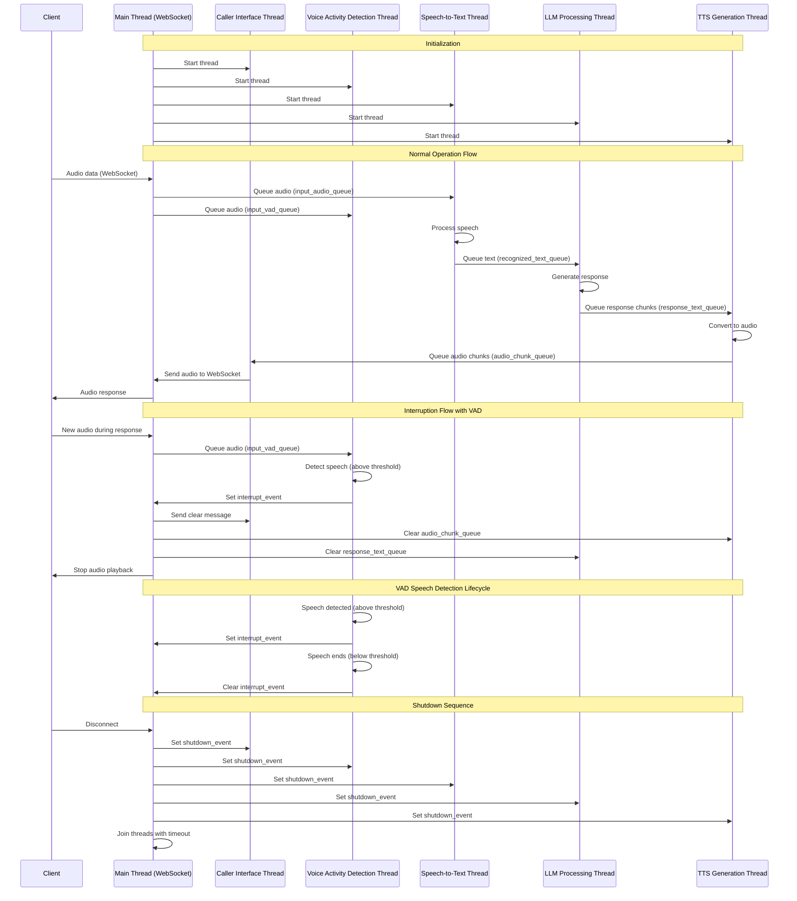
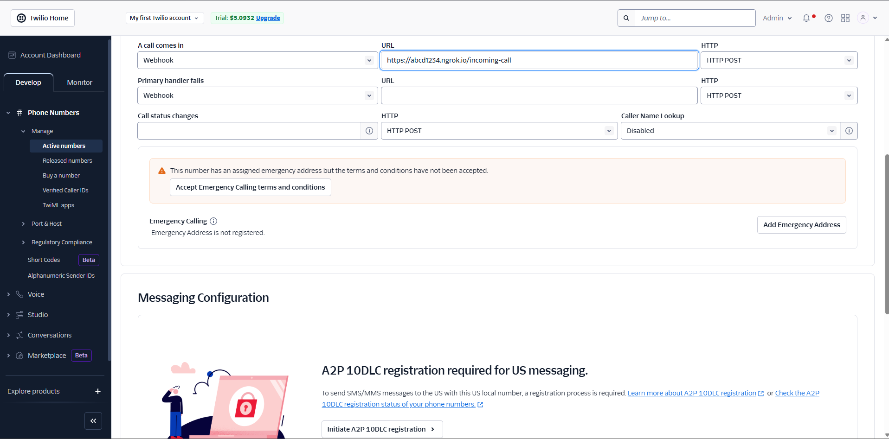

# Vaanify 🚀

**Vaanify** — "Your AI Voice Plugin : Convert ai agent into a phone call agent"  
A next-gen, real-time voice assistant framework blending Hindi heritage with cutting-edge tech.
Speak. Interrupt. Get instant AI vibes. All in one modular stack.

---

## 🎯 Goal

The goal of this repo is to provide a simple pip package where you can pass your LangChain agent, and your AI agent is instantly ready to talk on the phone no complex setup required.

---

## 🔥 Why Vaanify?

- **Ultra-Low Latency:** Open-source orchestration for real-time voice interaction.
- **Smart Interrupts:** Interrupt the AI even while it’s replying—instantly stops in under 250ms.
- **Plug-n-Play:** Bring any AI agent, swap the streaming code, and you’re good to go.
- **Phone Calls In Seconds** Your AI agent can now be accessed by phone call in a few easy steps.
- **Multilingual:** Supports conversations in multiple languages.

---

## 🛠️ Stack Flow



---

## ⚡ Quickstart

1. **Clone the Repo**

   ```bash
   git clone https://github.com/yourusername/vaanify.git
   cd vaanify
   ```

2. **Setup Environment Variables**  
   Copy `.env.example` to `.env` and fill in your credentials (Azure, ElevenLabs, Twilio, etc.).

   ```bash
   cp .env.example .env
   # Edit .env with your keys and settings
   ```

3. **Install Requirements And Run**

   ```bash
   pip install -r requirements.txt
   python ai_voice_assitance.py
   ```

   **OR use Docker:**

   ```bash
   docker build -t voice-ai .
   docker run --env-file .env -p 8010:8010 --name voice-ai voice-ai
   ```

4. **Expose Locally with ngrok**

   ```bash
   ngrok http 8010
   ```

5. **Configure Twilio Webhook**  
   In your Twilio Console, set the webhook for your phone number to the ngrok URL followed by `/incoming-call` (e.g., `https://abcd1234.ngrok.io/incoming-call`).

   

---

## ✅ Progress Tracker

### ✔️ What’s Done
- [x] **Voice Activity Detection:** Using `silero_vad` for real-time voice detection and instant interrupt.
- [x] **Speech-to-Text:** Integrated Azure Speech-to-Text for accurate transcription.
- [x] **Conversational Agent:** Powered by LangChain for flexible AI agent logic.
- [x] **Text-to-Speech:** Using ElevenLabs for high-quality AI voice.
- [x] **Voice Calling:** Twilio integration for phone call access to your AI agent.

### ⏭️ Next Up
- [ ] **Tool-Calling Agent:** Enable the agent to call external tools and APIs.
- [ ] **Lower Latency:** Explore fine-tuned TTS models for even faster response.
- [ ] **Publish pip Package:** Release as a pip package to make integration even smoother.

### 🛠️ Tools Used
- **Azure Speech-to-Text** — Fast, accurate transcription.
- **silero_vad** — Voice activity detection and interruption.
- **LangChain** — Modular agent framework.
- **ElevenLabs** — Realistic text-to-speech.
- **Twilio** — Voice call connectivity

---

## 🤝 Collab

Contributions, suggestions, and ideas are always welcome!  
Join in to help shape the future of AI conversations—let’s build something amazing together.

---

## 📜 License

MIT

---